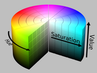

# Title: Colorspace in Image processing basics

# Knowledge

- ## Brief explanation
   Changing from one colorspace to another such as BGR image to HSV.
   
   There are more than 150 color-space conversion methods available in OpenCV.

   Example: For HSV, hue range is [0,179], saturation range is [0,255], and value range is [0,255]
   
- ## Psuedocode / Major Steps

   ColorSpace convertion:

  - import libraries
  - define image path
  - read image
  - visualize image
  - change color space 
  - visualize new image
  - set waitkey
  

- ## Use cases and scenario
  General image processing for computer vison related tasks such as 
  - Object tracking
- ## Techniques
- ## Alternatives Techniques
