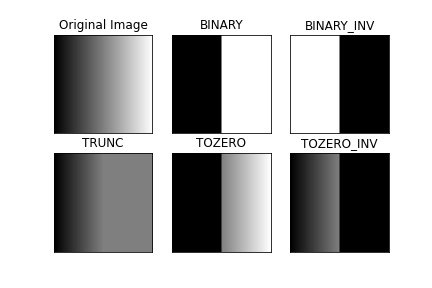
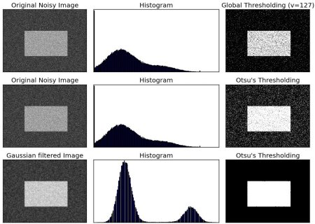

# Title: Thresholding basics

# Knowledge

- ## Brief explanation
  For every pixel, a threshold value is applied. If the pixel value is smaller than the threshold, it is set to 0, otherwise it is set to a maximum value.

  This can be seen as classification of pixels using threshold value into two classes e.g minimum:0 and maximum:255

  The is done one grayscale images/frames

- ## Psuedocode / Major Steps

  threshold image:

  - import libraries
  - define image path
  - read image
  - convert to grayscale or equivalent
  - threshold image
  - visualize threshold image
  - set waitkey

- ## Use cases and scenario
  - Image masking 
  - Image denoising

- ## Techniques
  Basic threshold includes:

  
- ## Alternatives Techniques
  - ### Adaptive Thresholding

  The algorithm determines the threshold for a pixel based on a small region around it. i.e different thresholds for different regions

  Useful scenario includes processing images with different lighting conditions in different areas.

  Adaptive Threshold calculation methods:

  1. MEAN: The threshold value is the mean of the neighbourhood area (blockSize) minus the constant C.

  2. GAUSSIAN: The threshold value is a gaussian-weighted sum of the neighbourhood values (blockSize) minus the constant C.

  C is a constant that is subtracted from the mean or weighted sum of the neighbourhood pixels.

  - ### Otsu's Binarization
  Otsu's method avoids having to choose an arbitrary value as a threshold and determines it automatically.

  Otsu's method determines an optimal global threshold value from the image histogram.

  

