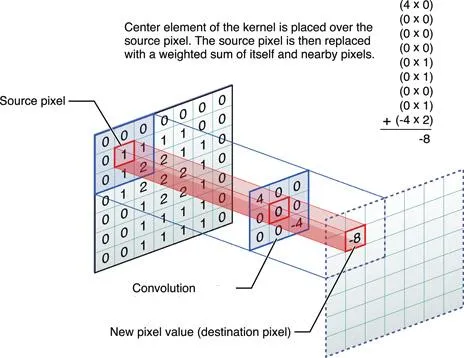

# Title: Smoothing Images / 2D Convolution (Image Filtering)

# Knowledge

- ## Brief explanation
  The act of filtering images with low-pass filers (LFP), highpass filters (HPF), etc.

  Low pass filter: It attenuates the high-frequency components and preserves the low-frequency components. 

  High pass filter: It attenuates the low-frequency components and preserves the high-frequency components. 

  This is achieved with convolution which is the process of transforming an image by applying a kernel over each pixel and its local neighbors across the entire image. 
  
  The kernel is a matrix of values whose size and values determine the transformation effect of the convolution process.

  

   
- ## Psuedocode / Major Steps

  Blur image: Image blurring is achieved by convolving the image with a low-pass filter kernel

  - import libraries
  - define image path
  - read image
  - set kernel size
  - blur image
  - visualize blurred image
  - set waitkey

- ## Use cases and scenario
  - LPF helps in removing noise, blurring images etc. 
  - HPF filters help in finding edges in images.
- ## Techniques
  - Averaging: It simply takes the average of all the pixels under the kernel area and replaces the central element.
  - Median Blurring: takes the median of all the pixels under the kernel area and the central element is replaced with this median value.
  - Gaussian Blurring: using standard deviation in the X and Y directions, sigmaX and sigmaY. 
    Gaussian filter takes the neighbourhood around the pixel and finds its Gaussian weighted average. It is a function of space alone, that is, nearby pixels are considered while filtering. It doesn't consider whether pixels have almost the same intensity. It doesn't consider whether a pixel is an edge pixel or not. So it blurs the edges also
- ## Alternatives Techniques
  - Bilateral Filtering: highly effective in noise removal while keeping edges sharp
      Bilateral filtering uses a Gaussian filter in space and Gaussian filter of intensity which is a function of pixel difference.
      So it preserves the edges since pixels at edges will have large intensity variation.
